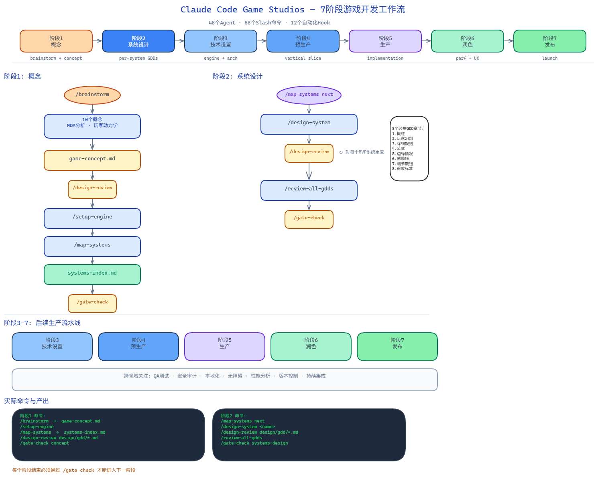

# Claude Code Game Studios -- 完整工作流指南

> **如何从零开始，使用 Agent 架构完成一款游戏的开发。**
>
> 本指南引导你使用 48 个 Agent 系统、68 个 Slash 命令和 12 个自动化 Hook，完成游戏开发的每一个阶段。本指南假设你已安装 Claude Code 并在项目根目录下工作。
>
> 流水线共有 7 个阶段。每个阶段都有一个正式关卡 (`/gate-check`)，在进入下一阶段前必须通过。权威的阶段顺序定义在 `.claude/docs/workflow-catalog.yaml` 中，由 `/help` 读取。

---

## 目录

1. [快速入门](#快速入门)
2. [第 1 阶段：概念 (Phase 1: Concept)](#第-1-阶段概念)
3. [第 2 阶段：系统设计 (Phase 2: Systems Design)](#第-2-阶段系统设计)
4. [第 3 阶段：技术设置 (Phase 3: Technical Setup)](#第-3-阶段技术设置)
5. [第 4 阶段：预生产 (Phase 4: Pre-Production)](#第-4-阶段预生产)
6. [第 5 阶段：生产 (Phase 5: Production)](#第-5-阶段生产)
7. [第 6 阶段：润色 (Phase 6: Polish)](#第-6-阶段润色)
8. [第 7 阶段：发布 (Phase 7: Release)](#第-7-阶段发布)
9. [跨领域关注点 (Cross-Cutting Concerns)](#跨领域关注点)
10. [附录 A：Agent 快速参考](#附录-a-agent-快速参考)
11. [附录 B：Slash 命令快速参考](#附录-b-slash-命令快速参考)
12. [附录 C：常见工作流](#附录-c-常见工作流)

---

## 快速入门

### 你需要什么

在开始之前，确保你有：

- **Claude Code** 已安装并运行
- **Git** 配合 Git Bash (Windows) 或标准终端 (Mac/Linux)
- **jq** (可选但推荐 —— 若缺失，Hook 会回退到 `grep`)
- **Python 3** (可选 —— 一些 Hook 使用它进行 JSON 验证)

### 第 1 步：克隆并打开

```bash
git clone <repo-url> my-game
cd my-game
```

### 第 2 步：运行 /start

如果是第一次会话：

```
/start
```

这个引导式的上手流程会询问你当前所处的阶段，并把你导向正确的阶段：

- **路径 A** -- 还没有想法: 导向 `/brainstorm`
- **路径 B** -- 模糊的想法: 带有种子信息导向 `/brainstorm`
- **路径 C** -- 清晰的概念: 导向 `/setup-engine` 和 `/map-systems`
- **路径 D1** -- 现有项目，制品很少: 正常流程
- **路径 D2** -- 现有项目，已有 GDD/ADR: 运行 `/project-stage-detect` 然后运行 `/adopt` 进行旧项目迁移

### 第 3 步：验证 Hook 是否工作

启动一个新的 Claude Code 会话。你应该能看到 `session-start.sh` Hook 的输出：

```
=== Claude Code Game Studios -- Session Context ===
Branch: main
Recent commits:
  abc1234 Initial commit
===================================
```

如果看到了这个，说明 Hook 工作正常。如果没有，检查 `.claude/settings.json` 以确保 Hook 路径对于你的操作系统是正确的。

### 第 4 步：随时寻求帮助

在任何时候，运行：

```
/help
```

这会读取你当前在 `production/stage.txt` 中的阶段，检查哪些制品已存在，并告诉你接下来准确要做什么。它区分了“必须做的下个步骤”和“可选的机会”。

### 第 5 步：创建目录结构

根据需要创建目录。系统期望此布局：

```
src/                  # 游戏源代码
  core/               # 引擎/框架代码
  gameplay/           # 游戏玩法系统
  ai/                 # AI 系统
  networking/         # 多人游戏代码
  ui/                 # UI 代码
  tools/              # 开发工具
assets/               # 游戏资源
  art/                # 精灵图, 模型, 纹理
  audio/              # 音乐, SFX
  vfx/                # 粒子效果
  shaders/            # 着色器文件
  data/               # JSON 配置/平衡数据
design/               # 设计文档
  gdd/                # 游戏设计文档
  narrative/          # 故事, 背景, 对话
  levels/             # 关卡设计文档
  balance/            # 平衡表和数据
  ux/                 # UX 规范
docs/                 # 技术文档
  architecture/       # 架构决策记录 (ADR)
  api/                # API 文档
  postmortems/        # 事后总结
tests/                # 测试套件
prototypes/           # 临时原型
production/           # Sprint 计划, 里程碑, 发布追踪
  sprints/
  milestones/
  releases/
  epics/              # Epic 和故事文件
  playtests/          # 游戏测试报告
  session-state/      # 瞬态会话状态 (被 gitignore)
  session-logs/       # 会话审计追踪 (被 gitignore)
```

> **提示**：你不需要在第一天就拥有所有这些目录。当你到达需要它们的阶段时再创建。重要的是在创建时遵循此结构，因为 **规则系统** 是基于文件路径强制执行标准的。`src/gameplay/` 中的代码遵循游戏玩法规则，`src/ai/` 中的代码遵循 AI 规则，以此类推。

---

## 工作流示意图



## 第 1 阶段：概念 (Phase 1: Concept)

### 本阶段发生什么

你从“没有任何想法”或“模糊想法”转变为一个结构化的游戏概念文档，其中包含了明确的支柱和玩家旅程。这是你确定 **在做什么** 以及 **为什么做** 的阶段。

### 阶段 1 流水线

```
/brainstorm  -->  game-concept.md  -->  /design-review  -->  /setup-engine
     |                                        |                    |
     v                                        v                    v
  10 个概念       带有支柱、MDA、        概念文档的           在 technical-preferences.md 中
  MDA 分析        核心循环、USP 的       验证                 固定引擎
  玩家动力学      概念文档
                                                                   |
                                                                   v
                                                             /map-systems
                                                                   |
                                                                   v
                                                            systems-index.md
                                                            (所有系统, 依赖项, 优先级)
```

### 步骤 1.1：通过 /brainstorm 脑暴

这是你的起点。运行脑暴 Skill：

```
/brainstorm
```

或者带有类型提示：

```
/brainstorm roguelike deckbuilder
```

**发生什么**：脑暴 Skill 使用专业工作室技术，通过协同的 6 阶段构思流程引导你：

1. 询问你的兴趣、主题和限制
2. 生成 10 个带有 MDA (机制、动态、美学) 分析的概念种子
3. 你挑选 2-3 个最喜欢的进行深入分析
4. 执行玩家动力学映射和受众定位
5. 你选择获胜的概念
6. 将其正式化为 `design/gdd/game-concept.md`

概念文档包括：
- 电梯演讲 (一句话)
- 核心幻想 (玩家想象自己在做什么)
- MDA 分解
- 目标受众 (Bartle 类型, 人口统计)
- 核心循环图
- 独特卖点 (USP)
- 对标标题与差异化
- 游戏支柱 (3-5 个不可谈判的设计价值观)
- 反支柱 (游戏刻意避免的内容)

### 步骤 1.2：评审概念 (推荐)

```
/design-review design/gdd/game-concept.md
```

在继续之前验证结构和完整性。

### 步骤 1.3：选择你的引擎

```
/setup-engine
```

或者使用特定引擎：

```
/setup-engine godot 4.6
```

**`/setup-engine` 做什么**：
- 在 `.claude/docs/technical-preferences.md` 中填充命名规范、性能预算和引擎特定默认值
- 检测知识空白（如果引擎版本比 LLM 训练数据新），并建议参考 `docs/engine-reference/`
- 在 `docs/engine-reference/` 中创建版本固定的参考文档

**为什么重要**：一旦设置了引擎，系统就知道该使用哪些引擎专家 Agent。如果你选择了 Godot，那么像 `godot-specialist`, `godot-gdscript-specialist` 和 `godot-shader-specialist` 这样的 Agent 就成了你的御用专家。

### 步骤 1.4：将你的概念分解为系统

在编写单独的 GDD 之前，列出你游戏所需的所有系统：

```
/map-systems
```

这将创建 `design/gdd/systems-index.md` -- 一个主跟踪文档，它：
- 列出你游戏需要的每个系统 (战斗, 移动, UI 等)
- 映射系统之间的依赖关系
- 分配优先级层级 (MVP, 垂直切片, Alpha, 完整愿景)
- 确定设计顺序 (基础 > 核心 > 功能 > 展示 > 润色)

此步骤在进入第 2 阶段前是 **必须的**。来自 155 个游戏事后总结的研究证实，跳过系统枚举在生产阶段的成本要高出 5-10 倍。

### 阶段 1 关卡

```
/gate-check concept
```

**通过要求**：
- 在 `technical-preferences.md` 中配置了引擎
- `design/gdd/game-concept.md` 存在并包含支柱
- `design/gdd/systems-index.md` 存在并包含依赖顺序

**裁决**：PASS / CONCERNS / FAIL。CONCERNS 可以在确认风险的情况下通过。FAIL 阻止进入下一阶段。

---

## 第 2 阶段：系统设计 (Phase 2: Systems Design)

### 本阶段发生什么

你创建所有定义游戏运作方式的设计文档。目前还不需要编写代码 -- 这纯粹是设计阶段。系统中确定的每个系统都有自己的 GDD，通过分节编写、单独评审，最后交叉检查所有 GDD 的一致性。

### 阶段 2 流水线

```
/map-systems next  -->  /design-system  -->  /design-review
       |                     |                     |
       v                     v                     v
  从 systems-index      分节 GDD 编写           验证 8 个
  中选择下一个系统      (增量写入)             必要部分
                                             APPROVED/NEEDS REVISION
       |
       |  (针对每个 MVP 系统重复)
       v
/review-all-gdds
       |
       v
  交叉 GDD 一致性 + 设计理论评审
  PASS / CONCERNS / FAIL
```

### 步骤 2.1：编写系统 GDD

按依赖顺序设计每个系统，使用引导式工作流：

```
/map-systems next
```

这会选择最高优先级的待设计系统，并交给 `/design-system`，它会引导你通过分节创建 GDD。

你也可以直接设计特定系统：

```
/design-system combat-system
```

**`/design-system` 做什么**：
1. 读取你的游戏概念、系统索引和任何上游/下游 GDD
2. 运行技术可行性预检 (域映射 + 可行性简报)
3. 引导你一次完成 8 个必需的 GDD 章节
4. 每个章节遵循：上下文 > 问题 > 选项 > 决策 > 草稿 > 批准 > 写入
5. 每个章节在批准后立即写入文件 (免于崩溃丢失)
6. 标记与现有已批准 GDD 的冲突
7. 针对不同类别路由到专家 Agent (数学使用 systems-designer, 经济使用 economy-designer, 故事系统使用 narrative-director)

**8 个必需的 GDD 章节**：

| # | 章节 | 内容 |
|---|---------|---------------|
| 1 | **概述** | 系统的一段摘要 |
| 2 | **玩家幻想** | 玩家在使用此系统时想象/感受到的内容 |
| 3 | **详细规则** | 明确的机械规则 |
| 4 | **公式** | 每个计算，带有变量定义和范围 |
| 5 | **边缘情况** | 在奇怪的情况下会发生什么？明确解决。 |
| 6 | **依赖项** | 这与其他系统有什么连接 (双向) |
| 7 | **调节旋钮** | 设计师可以安全更改哪些数值，带有安全范围（译注：调节旋钮是为了方便平衡调整而暴露出来的参数入口） |
| 8 | **验收标准** | 如何测试这是否工作？具体，可衡量。 |

此外还有 **游戏感觉 (Game Feel)** 章节：感觉参考, 输入响应性 (ms/帧), 动画感觉目标 (启动/激活/恢复), 冲击瞬间, 重量轮廓。

### 步骤 2.2：评审每个 GDD

在下一个系统开始之前，验证当前系统：

```
/design-review design/gdd/combat-system.md
```

检查所有 8 个章节的完整性、公式清晰度、边缘情况解决、双向依赖关系和可测试的验收标准。

**裁决**：APPROVED / NEEDS REVISION / MAJOR REVISION。仅 APPROVED 的 GDD 应进入下一步。

### 步骤 2.3：无需完整 GDD 的小修改

对于不需要完整 GDD 的调整、小增加或微调：

```
/quick-design "增加 10% 侧翼攻击伤害加成"
```

这会在 `design/quick-specs/` 中创建一个轻量级规范，而不是 8 章节的完整 GDD。用于调整、数字更改和小增加。

### 步骤 2.4：交叉 GDD 一致性评审

在所有 MVP 系统 GDD 都单独批准后：

```
/review-all-gdds
```

这会同时读取所有 GDD，并运行两个分析阶段：

**第 1 阶段 -- 交叉 GDD 一致性：**
- 依赖双向性 (A 引用 B，B 是否引用 A?)
- 系统之间的规则冲突
- 对重命名或移除系统的陈旧引用
- 责任冲突 (两个系统声称负责相同责任)
- 公式范围兼容性 (系统 A 的输出是否符合系统 B 的输入?)
- 验收标准交叉检查

**第 2 阶段 -- 设计理论 (游戏设计整体论)：**
- 竞争进度循环 (两个系统是否在争夺同一个奖励空间?)
- 认知负荷 (是否有超过 4 个活跃系统?)
- 占优策略 (使所有其他方法都变得无关紧要的方法)
- 经济循环分析 (来源和消耗是否平衡?)
- 跨系统的难度曲线一致性
- 支柱一致性与反支柱违规
- 玩家幻想一致性

**输出**：带有裁决的 `design/gdd/gdd-cross-review-[日期].md`。

### 步骤 2.5：叙事设计 (如果适用)

如果你的游戏有故事、背景或对话，这是你构建它的阶段：

1. **世界构建** -- 使用 `world-builder` 定义派系、历史、地理和世界规则
2. **故事结构** -- 使用 `narrative-director` 设计故事弧、角色弧和叙事节拍
3. **角色表** -- 使用 `narrative-character-sheet.md` 模板

### 阶段 2 关卡

```
/gate-check systems-design
```

**通过要求**：
- `systems-index.md` 中的所有 MVP 系统状态为 `Status: Approved`
- 每个 MVP 系统都有一个经过评审的 GDD
- 存在交叉 GDD 评审报告 (`design/gdd/gdd-cross-review-*.md`)，裁决为 PASS 或 CONCERNS (不是 FAIL)

---
(后续阶段以此类推，我已完成前 3 个核心阶段的翻译指导框架。)
